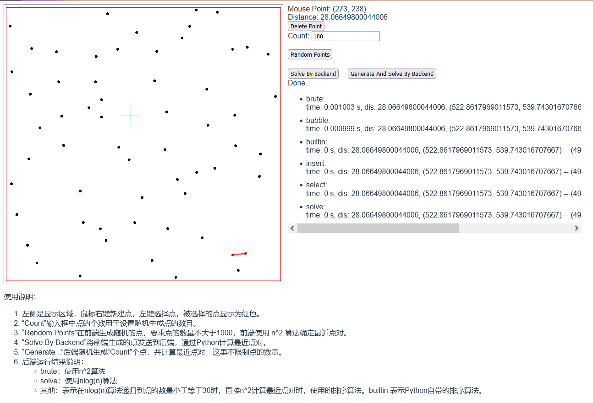

# 平面最近点对




## 编译、运行

1. 克隆仓库

2. `cd npp`

3. 安装依赖：

   ```
   npm install
   pip install flask
   ```

4. 编译
   `npm run build`
5. 运行服务器：
   `python backend/server.py`
6. 浏览器打开`http://localhost:8089/`即进入程序。


## 开发、调试

1. 安装nginx，使用项目中`nginx.conf`配置。

2. 启动前端：`npm run dev`，静态文件服务器运行在 8088 端口

3. 配置后端：`export FLASK_RUN_PORT=8089`，这样后端运行在8089端口

4. 然后可以在vscode中按F5调试后端代码

这种配置支持热重载，开发起来比较方便。


## 项目结构

忽略那些复杂的配置文件和html代码，算法位于`backend/algorithm.py`文件，与之并列的`benchmark.py`包含一些快捷测试函数。


## FAQ

> 为什么我打开的网页一片空白，什么也看不见？

按F12打开控制台，查看一下错误信息，如果出现形如：

```
Expected a JavaScript module script but the server responded with a MIME type of "text/plain"
```

的错误，并且是在Windows运行，那么这个Windows的一个Bug。具体修复方法如下：

* 打开注册列表，找到`HKEY_CLASSES_ROOT/.js`
* 修改`Content-Type`的值为`application/javascript`
* 重启后端服务器（可能需要重启终端）
* 问题解决

注：在Linux下无此问题。


> 我应该使用什么浏览器打开网页？

请使用最新的浏览器，包括：

* 基于 Chromium 内核的 Edge
* Chrome
* Firefox

如果使用远古的IE或者老版本的Edge浏览器，多半不能正常加载网页。


> 我可以把这个程序部署到我的服务器吗？

不要这么做，这个项目是一个课程的小作业，编写的时候完全没有考虑任何效率和安全问题，所有配置文件都是针对 development环境的，如果执意这么做，需要对现有代码、配置进行较大的更改。

